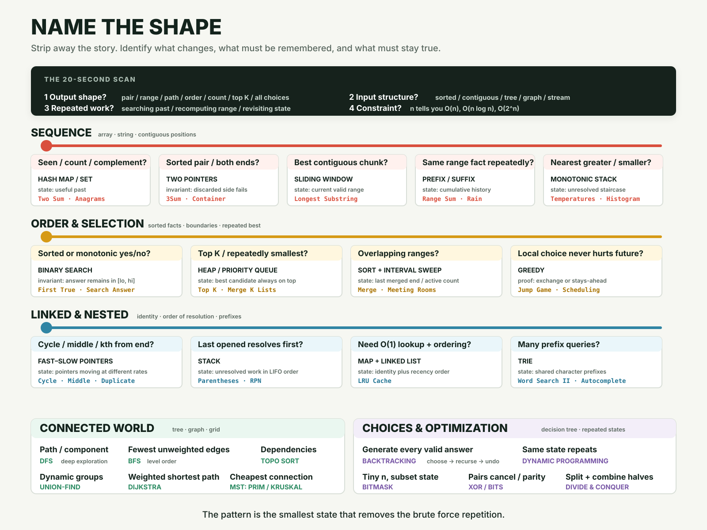
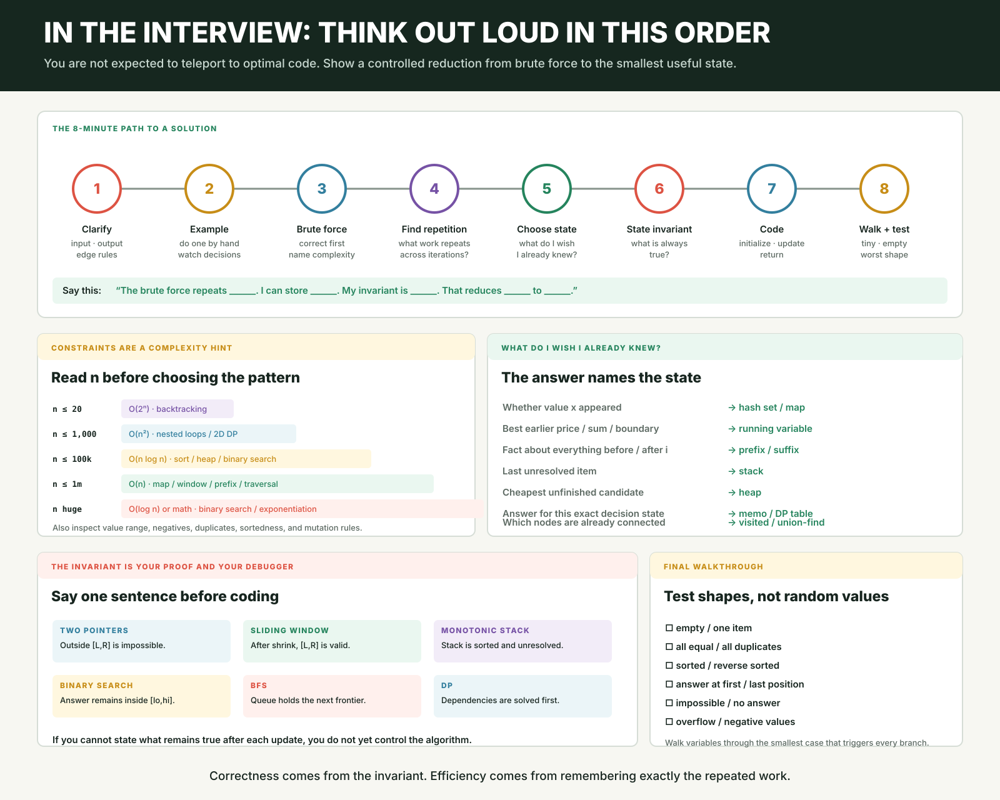
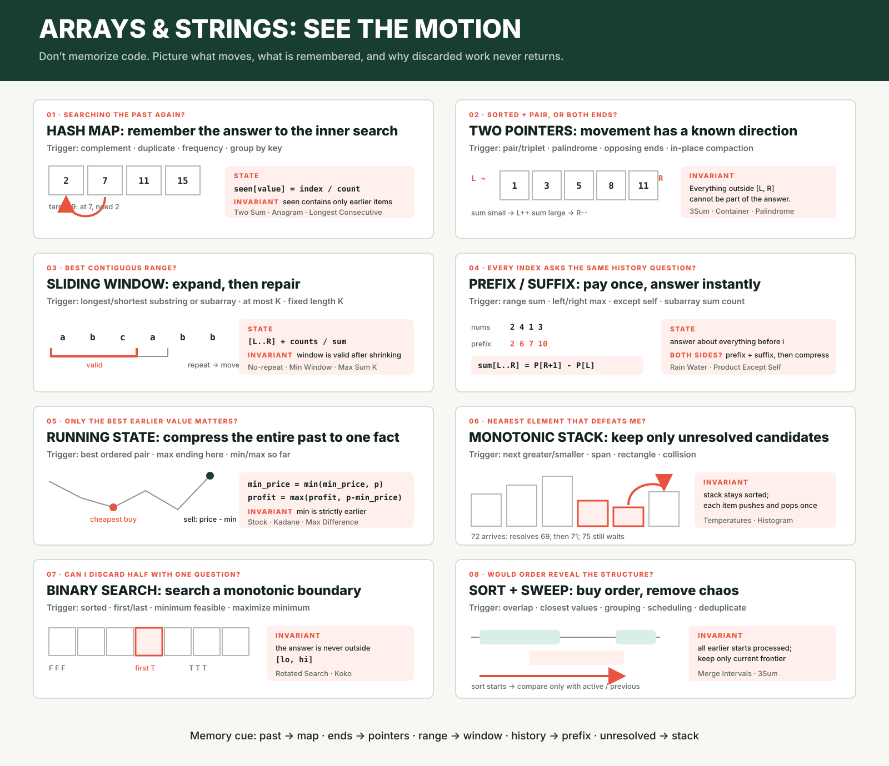
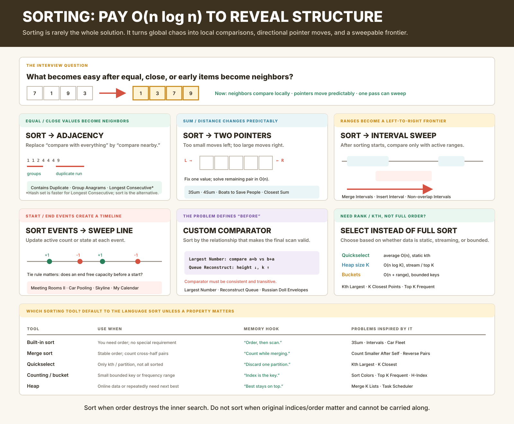
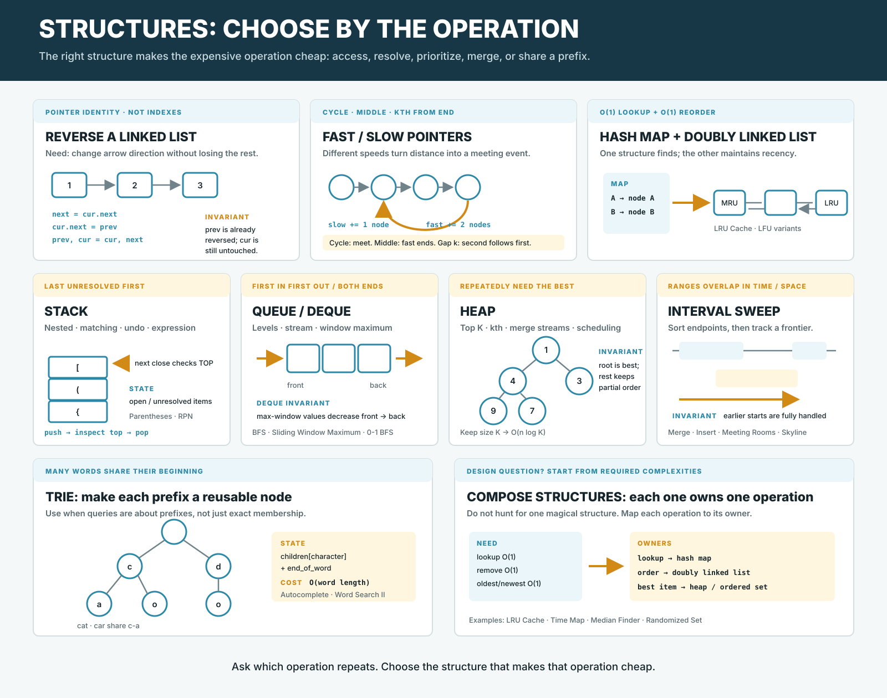
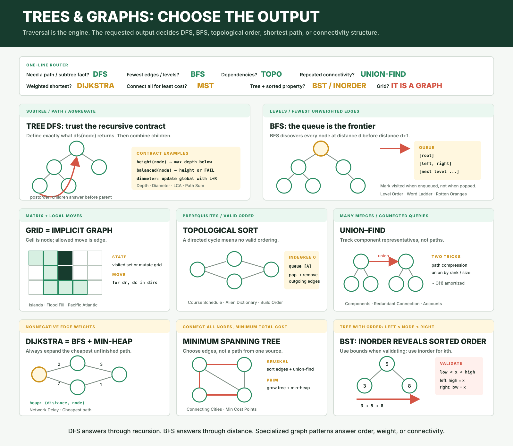
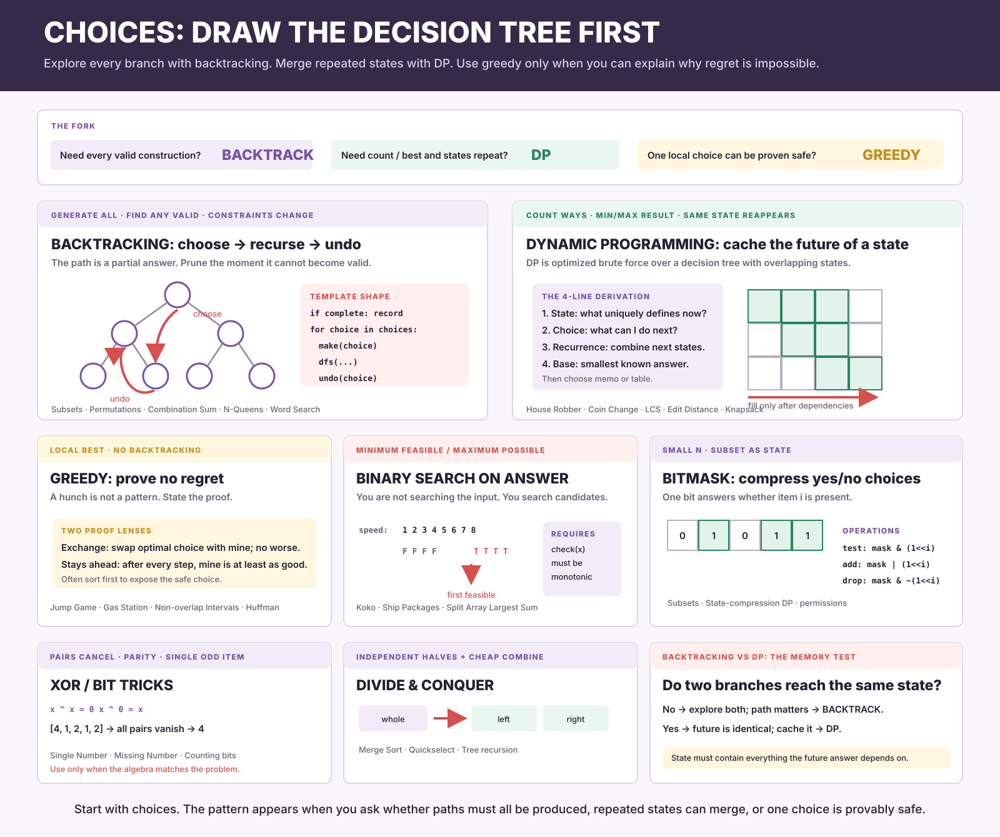

# DSA Interview Pattern Recognition Guide

This is a pre-interview guide for recognizing Data Structures and Algorithms
patterns quickly. The goal is not to memorize 200 solutions. The goal is to
look at a problem, identify its underlying shape, choose the right data
structure, and explain your thought process clearly.

## The Core Question

Most DSA problems become easier when you ask:

```text
At this point in the input, what information do I wish I already knew?
```

Examples:

```text
Two Sum:
I wish I knew if the complement was already seen.
Pattern: hash map

Best Time to Buy and Sell Stock:
If today is the sell day, I wish I knew the cheapest earlier buy price.
Pattern: one-pass scan with running minimum

Trapping Rain Water:
At each bar, I wish I knew the tallest wall on the left and right.
Pattern: prefix/suffix max or two pointers

Top K Frequent:
I wish I knew the count of every number first.
Pattern: hash map, then heap or bucket sort
```

That one question turns "I do not know the algorithm" into "what state do I
need to carry?"

## Visual Interview Atlas

Use the atlas in this order. The first two sheets are the pre-interview review;
the remaining sheets build recognition by problem domain.

### 1. Route Any Problem: Name The Shape

This is the master map. Start with the requested output and input structure,
then route toward the smallest state that removes repeated work.



### 2. Execute In The Interview

This sheet turns recognition into a controlled interview process: constraints,
brute force, repeated work, useful state, invariant, code, and edge-case tests.



### 3. Arrays And Strings: See The Motion

Use this for hash maps, two pointers, windows, prefix/suffix state, running
state, monotonic stacks, binary search, and sorting sweeps.



### 4. Sorting: Reveal The Hidden Structure

Use this when ordering makes equal values adjacent, pointer motion monotonic,
intervals sweepable, events chronological, or rank easy to select.



### 5. Linked, Nested, And Ordered Structures

Use this for linked lists, fast/slow pointers, stacks, queues, deques, heaps,
intervals, tries, caches, and data-structure design questions.



### 6. Trees, Graphs, And Grids: Choose The Output

Use this to separate DFS, BFS, grid traversal, topological sort, union-find,
Dijkstra, minimum spanning trees, and BST-specific reasoning.



### 7. Choices And Optimization

Use this to distinguish backtracking, dynamic programming, greedy algorithms,
binary search on the answer, bitmasks, XOR, and divide-and-conquer.



## The Interview Loop

Use this loop every time:

```text
1. Restate the problem.
2. Give the brute force idea.
3. Identify the repeated work.
4. Ask what information would remove that repeated work.
5. Choose the pattern/data structure.
6. State the invariant.
7. Code the simplest version.
8. Walk through one example.
9. Give time and space complexity.
```

The important part is step 6.

An invariant is the thing that is always true while your code runs.

Example:

```text
Stock invariant:
min_price is the cheapest price seen before today.
max_profit is the best profit seen so far.
```

If you can say the invariant clearly, the code usually becomes clear.

## Fast Pattern Decision Tree

When you read the problem, scan for these signals.

```text
Need to know if something appeared before?
Use hash set/map.

Need counts/frequencies?
Use hash map.

Input is sorted and asks for pair/triplet?
Use two pointers.

Need contiguous subarray/substring?
Use sliding window or prefix sum.

Need sum/range between i and j?
Use prefix sum.

Need nearest greater/smaller element?
Use monotonic stack.

Need matching parentheses/nested structure?
Use stack.

Need top K / repeated smallest/largest?
Use heap.

Need to search a sorted thing or a yes/no boundary?
Use binary search.

Need explore tree/graph/grid?
Use DFS/BFS.

Need generate all combinations/permutations/subsets?
Use backtracking.

Need optimize choices over time with repeated subproblems?
Use dynamic programming.

Need merge or detect overlaps?
Use intervals sorted by start/end.

Need connected components / grouping / cycle in undirected graph?
Use Union Find.

Need prefix words/search suggestions?
Use Trie.
```

## Array And String Master Shapes

Most array/string problems reduce to a few shapes:

```text
Sorted + need pair/triplet:
Two pointers converging.

Contiguous window with a running condition:
Sliding window.

Need O(1) lookup for seen/count/complement:
Hash map or hash set.

Need nearest greater/smaller:
Monotonic stack.

Need range sum/max/min facts:
Prefix/suffix precomputation.

Need best buy/sell, max profit, min so far:
One-pass scan with running state.
```

## Sorting Is A Transformation, Not Usually The Answer

Sorting costs `O(n log n)`, but it can remove an `O(n)` inner search from every
iteration. The useful question is:

```text
What becomes easy when equal, close, early, or extreme items become neighbors?
```

### When Sorting Should Enter Your Mind

| After Sorting... | Continue With | Interview Problems |
|---|---|---|
| Equal or close values become adjacent | One linear scan | Contains Duplicate, Group Anagrams, Longest Consecutive alternative |
| A sum changes predictably from both ends | Two pointers | 3Sum, 4Sum, 3Sum Closest, Boats to Save People |
| Ranges arrive from left to right | Interval sweep | Merge Intervals, Insert Interval, Non-overlapping Intervals |
| Starts and ends form a timeline | Event sweep or heap | Meeting Rooms II, Car Pooling, Skyline, My Calendar |
| Only the Kth or best K matter | Quickselect, heap, or buckets | Kth Largest, K Closest Points, Top K Frequent |
| Cross-half pairs can be counted while merging | Merge sort | Count of Smaller Numbers After Self, Reverse Pairs, Count Inversions |
| The problem defines a special notion of “before” | Custom comparator | Largest Number, Reconstruct Queue, Russian Doll Envelopes |

### The Recognition Script

```text
1. My brute force compares each item with many unrelated items.
2. If I sort, the relevant items become neighbors or have directional order.
3. I can then scan, use two pointers, sweep intervals, or select a rank.
4. Total becomes O(n log n), usually replacing O(n^2).
```

### Which Sorting Tool To Use

```text
Need ordinary order:
Use the language's built-in sort.

Need only Kth / partition:
Use quickselect for average O(n), or a heap for predictable O(n log K).

Keys are small bounded integers or frequencies:
Use counting sort or buckets.

Need to count pairs that cross from left half to right half:
Use merge sort and count during the merge.

Data arrives over time and you repeatedly need the next best:
Use a heap. Do not repeatedly sort the entire stream.

Need a custom order:
Write the comparison rule explicitly and verify it is transitive.
```

### Problems Where Sorting Unlocks Another Pattern

```text
3Sum (LeetCode 15):
sort → fix one number → two pointers for the remaining pair

Merge Intervals (LeetCode 56):
sort by start → compare only with the last merged interval

Meeting Rooms II (LeetCode 253):
sort starts and ends → sweep the timeline and count active rooms

Car Fleet (LeetCode 853):
sort cars by position → scan arrival times with a monotonic stack idea

Largest Number (LeetCode 179):
custom sort by whether a+b should come before b+a

K Closest Points (LeetCode 973):
rank by distance → sort, heap of size K, or quickselect

Top K Frequent Elements (LeetCode 347):
count first → frequency buckets or heap; full sorting is optional

Count Smaller Numbers After Self (LeetCode 315):
merge sort → count how many right-half elements cross each left element

Russian Doll Envelopes (LeetCode 354):
sort width ascending and height descending → LIS on heights
```

### Sorting Traps

```text
Do not sort blindly when original order is the problem.
If indices matter, carry each value's original index with it.

Do not claim O(n) after sorting.
The full solution is at least O(n log n) unless you use bounded-key sorting.

Do not implement quicksort or mergesort unless asked.
Use the built-in sort and spend interview time on the actual pattern.

Tie-breaking is part of correctness.
Intervals, events, and custom comparators often fail only on equal values.
```

## Pattern Cheat Sheet

| Pattern | Recognition Cue | Mental Model |
|---|---|---|
| Hash set/map | Seen before, duplicates, counts, complements | Remember useful past info |
| Two pointers | Sorted array, pair search, left/right ends, palindrome | Shrink/search from both sides |
| Sliding window | Contiguous subarray/substring with condition | Expand right, shrink left |
| Prefix sum | Subarray sums, range sums, sum between i and j | Store cumulative history |
| Prefix/suffix max/min | Need best value to left/right of each index | Precompute what each index wishes it knew |
| Sorting | Order makes relevant values adjacent or sweepable | Pay once for order, then use a simpler pattern |
| Stack | Parentheses, nested things, undo-like behavior | Last unresolved item |
| Monotonic stack | Next greater/smaller, daily temperatures, histogram | Keep candidates in sorted stack order |
| Heap | Top K, Kth largest, repeated min/max, streaming | Keep best candidates available |
| Binary search | Sorted input or monotonic true/false condition | Find the boundary |
| DFS/BFS | Tree, graph, grid, connected components | Explore connected choices |
| Backtracking | All subsets, permutations, combinations | Choose, recurse, undo |
| Dynamic programming | Repeated subproblems, optimal choices | Cache answers to smaller problems |
| Intervals | Meetings, overlaps, merge ranges | Sort by start or end |
| Union Find | Connected components, grouping, cycles | Merge sets efficiently |
| Trie | Prefix search, dictionary words | Tree of characters |

---

# 1. Hash Map / Hash Set

## When To Recognize It

Use this when the problem says or implies:

```text
Have I seen this before?
How many times did this appear?
Is there a duplicate?
Can I find the complement quickly?
Can I group by some key?
```

## Mental Model

A hash map is memory.

Instead of searching the past again and again, store the useful part of the
past.

```text
Without hash map:
For every number, scan everything before it.

With hash map:
For every number, ask memory in O(1).
```

## Classic Examples

```text
Two Sum:
Need target - num.
Store previous numbers in a map.

Contains Duplicate:
Need to know if number appeared before.
Store seen numbers in a set.

Valid Anagram:
Need character counts.
Use frequency map.

Group Anagrams:
Need group key.
Use sorted word or 26-char count tuple as key.

Top K Frequent:
Need frequency first.
Hash map counts, then heap or bucket.

Longest Consecutive Sequence:
Need O(1) membership.
Use set.
```

## Template: Seen Before

```python
seen = set()

for x in nums:
    if x in seen:
        return True
    seen.add(x)

return False
```

## Template: Complement

```python
seen = {}

for i, num in enumerate(nums):
    need = target - num

    if need in seen:
        return [seen[need], i]

    seen[num] = i
```

## Interview Sentence

```text
The brute force repeats a search for each element. I can store the previous
values in a hash map so complement lookup becomes O(1).
```

---

# 2. Two Pointers

## When To Recognize It

Use this when:

```text
The input is sorted.
You need a pair/triplet.
You compare both ends.
You need to reverse something.
You need to check palindrome.
You need to remove duplicates in-place.
```

## Mental Model

Two pointers let you use the structure of the input.

For sorted arrays:

```text
smallest value is on the left
largest value is on the right
```

So if the sum is too small, move left forward.
If the sum is too large, move right backward.

## Visualization

```text
nums = [1, 2, 4, 6, 9], target = 10

        L           R
        1  2  4  6  9
sum = 10, found
```

If sum was 8:

```text
Too small -> need bigger number -> move L right
```

If sum was 13:

```text
Too large -> need smaller number -> move R left
```

## Classic Examples

```text
Two Sum II:
Sorted array, find pair.

3Sum:
Sort first, fix one number, then two pointers.

Valid Palindrome:
Left and right move inward.

Container With Most Water:
Left and right boundaries. Move the shorter wall.

Remove Duplicates From Sorted Array:
Read pointer and write pointer.
```

## Template: Sorted Pair

```python
l, r = 0, len(nums) - 1

while l < r:
    cur = nums[l] + nums[r]

    if cur == target:
        return [l, r]
    elif cur < target:
        l += 1
    else:
        r -= 1
```

## Template: Palindrome

```python
l, r = 0, len(s) - 1

while l < r:
    while l < r and not s[l].isalnum():
        l += 1
    while l < r and not s[r].isalnum():
        r -= 1

    if s[l].lower() != s[r].lower():
        return False

    l += 1
    r -= 1

return True
```

## Interview Sentence

```text
Because the array is sorted, moving a pointer has a predictable effect on the
sum. I can shrink the search space from both ends instead of checking all pairs.
```

---

# 3. Sliding Window

## When To Recognize It

Use this when the problem asks for:

```text
Longest substring...
Shortest subarray...
Maximum sum of a contiguous subarray of size k...
Contiguous window with at most/at least/exactly some condition...
```

The word "contiguous" is the big clue.

## Mental Model

A sliding window is a live range:

```text
[left ... right]
```

You expand right to include new things.
You shrink left when the window becomes invalid.

## Visualization

```text
s = "abcabcbb"

window: [a b c]
valid: no duplicates

add a:
[a b c a]
invalid: duplicate a

shrink left until valid:
[b c a]
```

## Classic Examples

```text
Longest Substring Without Repeating Characters:
Window must have no duplicates.

Minimum Window Substring:
Window must contain required counts.

Best Time to Buy and Sell Stock:
Can be seen as a loose window where left is best buy and right is sell day.

Longest Repeating Character Replacement:
Window is valid if changes needed <= k.

Max Sum Subarray of Size K:
Fixed-size window.
```

## Template: Variable Window

```python
left = 0
state = {}
best = 0

for right in range(len(nums)):
    # add nums[right] to state

    while window_is_invalid:
        # remove nums[left] from state
        left += 1

    best = max(best, right - left + 1)
```

## Template: Fixed Window

```python
window_sum = 0
best = float("-inf")

for right in range(len(nums)):
    window_sum += nums[right]

    if right >= k:
        window_sum -= nums[right - k]

    if right >= k - 1:
        best = max(best, window_sum)
```

## Interview Sentence

```text
The problem asks for a contiguous segment. I can maintain a window and update
the answer as I expand and shrink it, instead of rebuilding each segment.
```

---

# 4. Prefix Sum / Prefix-Suffix Precomputation

## When To Recognize It

Use this when:

```text
Need sum between i and j.
Need many range queries.
Need product/sum except self.
Need best value to the left or right of each index.
Need avoid recomputing the same range repeatedly.
```

## Mental Model

Precompute what each index wishes it knew.

```text
Prefix:
Information from the left.

Suffix:
Information from the right.
```

## Prefix Sum Visualization

```text
nums:    [2, 4, 1, 7]
prefix:  [0, 2, 6, 7, 14]

sum from index 1 to 3:
prefix[4] - prefix[1] = 14 - 2 = 12
```

## Classic Examples

```text
Range Sum Query:
prefix sums.

Subarray Sum Equals K:
prefix sum + hash map.

Product of Array Except Self:
prefix product and suffix product.

Trapping Rain Water:
left max and right max.

Best Time to Buy and Sell Stock, right-max version:
right max tells best future sell.
```

## Template: Prefix Sum

```python
prefix = [0]

for x in nums:
    prefix.append(prefix[-1] + x)

# sum nums[l:r + 1]
range_sum = prefix[r + 1] - prefix[l]
```

## Template: Prefix/Suffix Max

```python
n = len(nums)
left_max = [0] * n
right_max = [0] * n

for i in range(1, n):
    left_max[i] = max(left_max[i - 1], nums[i - 1])

for i in range(n - 2, -1, -1):
    right_max[i] = max(right_max[i + 1], nums[i + 1])
```

## Interview Sentence

```text
Each index needs information from a range. I can precompute prefix/suffix
values so each index can be answered in O(1).
```

---

# 5. One-Pass Running State

This is not always listed as a separate pattern, but it is one of the most
important interview instincts.

## When To Recognize It

Use this when:

```text
You are scanning left to right.
Each step only needs the best/min/max/count seen so far.
The brute force checks many previous elements.
```

## Mental Model

Carry the one useful fact from the past.

## Best Time To Buy And Sell Stock

Brute force:

```text
Try every buy day and every sell day after it.
```

Better question:

```text
If today is the sell day, what do I need from the past?
```

Answer:

```text
The cheapest buy price so far.
```

Visualization:

```text
prices:      10   1   7   2   20   0   30
min so far:  10   1   1   1    1   0    0
sell today:   0   0   6   1   19   0   30
best profit:  0   0   6   6   19  19   30
```

Code:

```python
min_price = prices[0]
max_profit = 0

for price in prices[1:]:
    max_profit = max(max_profit, price - min_price)
    min_price = min(min_price, price)

return max_profit
```

## Interview Sentence

```text
Instead of asking, "if I buy today, what future sell is best?", I can scan
left to right and ask, "if I sell today, what earlier buy was cheapest?"
```

---

# 6. Stack

## When To Recognize It

Use this when:

```text
You need the most recent unresolved thing.
Parentheses/brackets must match.
Nested expressions appear.
You need to undo the last operation.
```

## Mental Model

Stack means:

```text
Last in, first out.
```

You store things that are waiting to be resolved.

## Classic Examples

```text
Valid Parentheses:
Latest opening bracket must match current closing bracket.

Min Stack:
Need stack plus current min.

Evaluate Reverse Polish Notation:
Use stack for operands.

Decode String:
Nested repeat structure.
```

## Template: Valid Parentheses

```python
stack = []
match = {")": "(", "]": "[", "}": "{"}

for ch in s:
    if ch in match.values():
        stack.append(ch)
    else:
        if not stack or stack[-1] != match[ch]:
            return False
        stack.pop()

return not stack
```

## Interview Sentence

```text
I only care about the most recent unresolved opening bracket, so a stack is the
right structure.
```

---

# 7. Monotonic Stack

## When To Recognize It

Use this when the problem asks:

```text
Next greater element
Next smaller element
Previous greater/smaller
Daily temperatures
Largest rectangle in histogram
Remove digits to make smallest number
```

## Mental Model

A monotonic stack keeps candidates in increasing or decreasing order.

It removes elements that can no longer be useful.

For next greater element:

```text
Keep a decreasing stack.
When a bigger number appears, it resolves smaller previous numbers.
```

## Visualization

```text
temperatures = [73, 74, 75, 71, 69, 72, 76]

At 74:
74 is warmer than 73, so 73 is resolved.

At 75:
75 is warmer than 74, so 74 is resolved.

At 72:
72 resolves 69 and 71, but not 75.
```

## Template: Next Greater Element

```python
res = [-1] * len(nums)
stack = []  # indexes, values decreasing

for i, x in enumerate(nums):
    while stack and nums[stack[-1]] < x:
        j = stack.pop()
        res[j] = x
    stack.append(i)
```

## Template: Daily Temperatures

```python
res = [0] * len(temperatures)
stack = []  # indexes with unresolved warmer day

for i, temp in enumerate(temperatures):
    while stack and temperatures[stack[-1]] < temp:
        prev = stack.pop()
        res[prev] = i - prev
    stack.append(i)

return res
```

## Interview Sentence

```text
Each item waits until a future item resolves it. A monotonic stack keeps only
the unresolved candidates that could still matter.
```

---

# 8. Heap

## When To Recognize It

Use this when:

```text
Need top K.
Need kth largest/smallest.
Need repeatedly get smallest/largest.
Need process a stream.
Need merge sorted lists.
```

## Mental Model

A heap is a priority queue.

It gives you the current smallest or largest item efficiently.

```text
If you only need K best items, do not sort everything.
Keep a heap of size K.
```

## Classic Examples

```text
Kth Largest Element:
Min heap of size k.

Top K Frequent Elements:
Count with hash map, then heap or bucket.

Merge K Sorted Lists:
Heap stores current smallest node from each list.

Find Median From Data Stream:
Two heaps.
```

## Template: Top K With Min Heap

```python
import heapq

heap = []

for item, score in items:
    heapq.heappush(heap, (score, item))

    if len(heap) > k:
        heapq.heappop(heap)

return [item for score, item in heap]
```

## Top K Frequent Shape

```python
from collections import Counter
import heapq

count = Counter(nums)
heap = []

for num, freq in count.items():
    heapq.heappush(heap, (freq, num))
    if len(heap) > k:
        heapq.heappop(heap)

return [num for freq, num in heap]
```

## Interview Sentence

```text
I do not need a full sorted order. I only need the best K, so I can maintain a
heap of size K.
```

---

# 9. Binary Search

## When To Recognize It

Use this when:

```text
Input is sorted.
You need find an index/value.
You need first true / last false.
The answer space is monotonic.
You can ask: can we do it with X?
```

## Mental Model

Binary search finds a boundary.

Not just a value.

```text
False False False True True True
                  ^
              first true
```

## Classic Examples

```text
Binary Search:
Find target in sorted array.

Search in Rotated Sorted Array:
One side is always sorted.

Koko Eating Bananas:
Binary search speed.

Capacity To Ship Packages:
Binary search capacity.

Find Minimum in Rotated Sorted Array:
Binary search boundary.
```

## Template: Standard Binary Search

```python
l, r = 0, len(nums) - 1

while l <= r:
    mid = (l + r) // 2

    if nums[mid] == target:
        return mid
    elif nums[mid] < target:
        l = mid + 1
    else:
        r = mid - 1

return -1
```

## Template: First True

```python
l, r = 0, len(search_space)
answer = -1

while l <= r:
    mid = (l + r) // 2

    if condition(mid):
        answer = mid
        r = mid - 1
    else:
        l = mid + 1

return answer
```

## Interview Sentence

```text
The condition is monotonic: once X works, every larger X also works. That means
I can binary search the smallest working X.
```

---

# 10. DFS / BFS

## When To Recognize It

Use this when:

```text
Tree
Graph
Grid
Island
Connected component
Shortest path with equal edge weights
Level order traversal
```

## Mental Model

DFS:

```text
Go deep before trying siblings.
Good for recursion, connected components, path existence.
```

BFS:

```text
Explore level by level.
Good for shortest path in unweighted graphs.
```

## Classic Examples

```text
Number of Islands:
DFS/BFS from each unvisited land cell.

Clone Graph:
Traverse and map original to copy.

Binary Tree Level Order Traversal:
BFS.

Maximum Depth of Binary Tree:
DFS.

Course Schedule:
Graph cycle detection / topological sort.
```

## Template: Grid DFS

```python
def dfs(r, c):
    if (
        r < 0 or r >= rows or
        c < 0 or c >= cols or
        grid[r][c] != "1"
    ):
        return

    grid[r][c] = "0"

    dfs(r + 1, c)
    dfs(r - 1, c)
    dfs(r, c + 1)
    dfs(r, c - 1)
```

## Template: BFS

```python
from collections import deque

queue = deque([start])
seen = {start}

while queue:
    node = queue.popleft()

    for nei in graph[node]:
        if nei not in seen:
            seen.add(nei)
            queue.append(nei)
```

## Interview Sentence

```text
The problem is about connected structure. I can model it as a graph and explore
neighbors with DFS/BFS while marking visited nodes.
```

---

# 11. Backtracking

## When To Recognize It

Use this when:

```text
Generate all subsets.
Generate all permutations.
Generate all combinations.
Find all valid arrangements.
Try choices with constraints.
```

## Mental Model

Backtracking is controlled brute force.

```text
Choose.
Explore.
Undo.
```

You are building a decision tree.

## Visualization: Subsets

```text
For each number:
1. Include it.
2. Exclude it.
```

```text
             []
          /      \
        [1]       []
       /   \     /  \
   [1,2]  [1]  [2]  []
```

## Classic Examples

```text
Subsets:
Include/exclude each number.

Permutations:
Try each unused number.

Combination Sum:
Choose candidate, stay or move forward.

Letter Combinations of Phone Number:
One choice per digit.

N-Queens:
Place row by row with constraints.
```

## Template

```python
res = []
path = []

def backtrack(start):
    if reached_goal:
        res.append(path.copy())
        return

    for i in range(start, len(choices)):
        if not valid(choices[i]):
            continue

        path.append(choices[i])
        backtrack(i + 1)
        path.pop()

backtrack(0)
return res
```

## Interview Sentence

```text
The problem asks for all valid possibilities, so I will build candidates one
choice at a time and backtrack when a choice cannot lead to a valid answer.
```

---

# 12. Dynamic Programming

## When To Recognize It

Use this when:

```text
There are repeated subproblems.
You need count ways.
You need max/min over choices.
You make a sequence of decisions.
The same index/state appears again.
```

## Mental Model

DP is recursion plus memory.

Ask:

```text
What does dp[i] mean?
What choices do I have at i?
How do smaller answers build bigger answers?
```

## Classic Examples

```text
Climbing Stairs:
ways[i] = ways[i - 1] + ways[i - 2]

House Robber:
At each house, rob or skip.

Coin Change:
Minimum coins to make amount.

Longest Increasing Subsequence:
Best subsequence ending at i.

Word Break:
Can prefix ending at i be segmented?
```

## Template: Top-Down

```python
from functools import lru_cache

@lru_cache(None)
def dp(i):
    if base_case:
        return base_value

    return best_of_choices

return dp(0)
```

## Template: Bottom-Up

```python
dp = [0] * (n + 1)
dp[0] = base_value

for i in range(1, n + 1):
    dp[i] = transition_from_previous_states

return dp[n]
```

## Interview Sentence

```text
The brute force decision tree recomputes the same states. I can define dp[i] as
the best answer from this position and cache it.
```

---

# 13. Intervals

## When To Recognize It

Use this when:

```text
Meetings
Schedules
Time ranges
Overlaps
Merge ranges
Insert interval
Minimum rooms/resources
```

## Mental Model

Intervals become easier after sorting.

Usually sort by start time.

```text
If current.start <= previous.end:
They overlap.
```

## Classic Examples

```text
Merge Intervals:
Sort by start and merge overlaps.

Insert Interval:
Add new interval, then merge.

Meeting Rooms:
Check if any overlap.

Meeting Rooms II:
Track end times with min heap.

Non-overlapping Intervals:
Sort by end and greedily keep earliest finishing.
```

## Template: Merge Intervals

```python
intervals.sort()
merged = []

for start, end in intervals:
    if not merged or start > merged[-1][1]:
        merged.append([start, end])
    else:
        merged[-1][1] = max(merged[-1][1], end)

return merged
```

## Interview Sentence

```text
Once intervals are sorted by start time, overlap is local: I only need to
compare the current interval with the last merged interval.
```

---

# 14. Union Find

## When To Recognize It

Use this when:

```text
Connected components.
Are these two things connected?
Group merging.
Detect cycle in an undirected graph.
Number of provinces.
Accounts merge.
```

## Mental Model

Union Find maintains groups.

```text
find(x): which group is x in?
union(a, b): merge their groups.
```

## Classic Examples

```text
Number of Connected Components:
Union each edge.

Redundant Connection:
If edge connects nodes already connected, it forms a cycle.

Accounts Merge:
Union emails from same account.

Number of Provinces:
Union connected cities.
```

## Template

```python
parent = list(range(n))
rank = [1] * n

def find(x):
    while x != parent[x]:
        parent[x] = parent[parent[x]]
        x = parent[x]
    return x

def union(a, b):
    root_a = find(a)
    root_b = find(b)

    if root_a == root_b:
        return False

    if rank[root_a] < rank[root_b]:
        parent[root_a] = root_b
    elif rank[root_a] > rank[root_b]:
        parent[root_b] = root_a
    else:
        parent[root_b] = root_a
        rank[root_a] += 1

    return True
```

## Interview Sentence

```text
The problem repeatedly merges groups and asks about connectivity, so Union Find
lets me maintain components efficiently.
```

---

# 15. Trie

## When To Recognize It

Use this when:

```text
Prefix search.
Autocomplete.
Dictionary words.
Word search.
Starts with.
Many word lookups sharing prefixes.
```

## Mental Model

A Trie is a tree of characters.

Words sharing prefixes share nodes.

```text
cat
car

c -> a -> t
       -> r
```

## Classic Examples

```text
Implement Trie:
insert, search, startsWith.

Word Search II:
Trie + DFS on board.

Design Add and Search Words:
Trie with wildcard DFS.

Search Suggestions System:
Prefix lookup.
```

## Template

```python
class TrieNode:
    def __init__(self):
        self.children = {}
        self.is_word = False

class Trie:
    def __init__(self):
        self.root = TrieNode()

    def insert(self, word):
        node = self.root

        for ch in word:
            if ch not in node.children:
                node.children[ch] = TrieNode()
            node = node.children[ch]

        node.is_word = True

    def search(self, word):
        node = self.root

        for ch in word:
            if ch not in node.children:
                return False
            node = node.children[ch]

        return node.is_word
```

## Interview Sentence

```text
Because many words share prefixes, a Trie lets me reuse prefix work instead of
checking each word independently.
```

---

# The Big Interview Pattern: Brute Force To Optimized

Interviewers want to see how you move from obvious to efficient.

Use this phrasing:

```text
The brute force is ...
The repeated work is ...
The information I need to remember is ...
That suggests ...
My invariant is ...
```

Example: Two Sum

```text
The brute force checks every pair, which is O(n^2).
The repeated work is searching for the complement.
If I store previous numbers in a hash map, I can check the complement in O(1).
Invariant: the map contains numbers seen before the current index.
```

Example: Stock

```text
The brute force checks every buy/sell pair.
The repeated work is searching for the cheapest earlier buy day.
If I scan left to right and keep min_price, I can compute profit for each sell
day in O(1).
Invariant: min_price is the cheapest price before or at the current day.
```

Example: Rain Water

```text
For each index, water depends on the smaller of the tallest wall on the left and
the tallest wall on the right.
So I need left max and right max for each index, or a two-pointer method that
keeps those values while scanning.
```

Example: Top K Frequent

```text
I cannot know top K until I know frequencies.
First count with a hash map.
Then either use a heap of size K or bucket sort by frequency.
```

---

# How To Choose Between Similar Patterns

## Sliding Window vs Prefix Sum

Use sliding window when:

```text
The window condition can be fixed by moving left forward.
Values are often positive or the condition is monotonic.
```

Use prefix sum when:

```text
You need arbitrary subarray sums.
Negative numbers are involved.
You need count of subarrays.
```

Example:

```text
Minimum Size Subarray Sum with positive numbers:
Sliding window.

Subarray Sum Equals K with negative numbers:
Prefix sum + hash map.
```

## Two Pointers vs Hash Map

Use two pointers when:

```text
The array is sorted or can be sorted without losing the answer.
```

Use hash map when:

```text
You need original indexes.
Input is unsorted and sorting would break requirements.
```

Example:

```text
Two Sum:
Hash map because original indexes matter.

Two Sum II:
Two pointers because input is sorted.
```

## Heap vs Sorting

Use sorting when:

```text
You need full order.
```

Use heap when:

```text
You only need K best items.
The input is streaming.
```

## DFS vs BFS

Use DFS when:

```text
Need explore all connected nodes.
Need recursion feels natural.
Need path existence.
```

Use BFS when:

```text
Need shortest path in an unweighted graph.
Need level order.
```

## Backtracking vs DP

Use backtracking when:

```text
Need list all valid answers.
```

Use DP when:

```text
Need count, min, max, or boolean result.
Same states repeat.
```

---

# Problem Clues By Wording

| Wording In Problem | Think |
|---|---|
| "contains duplicate" | hash set |
| "frequency", "most common" | hash map, heap, bucket |
| "two numbers add to target" | hash map or two pointers if sorted |
| "sorted array" | binary search or two pointers |
| "contiguous subarray/substring" | sliding window or prefix sum |
| "longest substring with..." | sliding window |
| "range sum" | prefix sum |
| "next greater" | monotonic stack |
| "valid parentheses" | stack |
| "top k" | heap or bucket |
| "kth largest" | heap or quickselect |
| "minimum possible maximum" | binary search on answer |
| "island", "grid", "connected" | DFS/BFS |
| "all combinations/permutations" | backtracking |
| "number of ways" | DP |
| "minimum cost", "maximum profit over choices" | DP or greedy |
| "meetings", "overlap" | intervals |
| "connected components" | DFS/BFS or Union Find |
| "prefix search" | Trie |

---

# Mini Case Studies

## Case Study 1: Best Time To Buy And Sell Stock

Problem:

```text
Choose one buy day and one later sell day. Maximize profit.
```

Brute force:

```text
For every buy day, try every future sell day.
O(n^2)
```

Better view:

```text
Treat today as the sell day.
What do I need from the past?
The cheapest earlier buy price.
```

Pattern:

```text
One-pass running minimum.
```

Invariant:

```text
min_price = cheapest price seen so far
max_profit = best profit seen so far
```

Code:

```python
min_price = prices[0]
max_profit = 0

for price in prices[1:]:
    max_profit = max(max_profit, price - min_price)
    min_price = min(min_price, price)

return max_profit
```

## Case Study 2: Trapping Rain Water

Problem:

```text
How much water can sit above each bar?
```

Key insight:

```text
Water at index i depends on the shorter wall between:
1. tallest wall to the left
2. tallest wall to the right
```

Formula:

```text
water[i] = min(left_max[i], right_max[i]) - height[i]
```

Pattern:

```text
Prefix/suffix max, or optimized two pointers.
```

Interview sentence:

```text
Each index needs the best boundary on both sides. I can precompute those
boundaries, then calculate trapped water in one pass.
```

## Case Study 3: 3Sum

Problem:

```text
Find unique triplets that sum to 0.
```

Brute force:

```text
Try all triples.
O(n^3)
```

Better view:

```text
Sort the array.
Fix one number.
Now the remaining problem is Two Sum II on the rest of the array.
```

Pattern:

```text
Sort + two pointers.
```

Invariant:

```text
For fixed i, l and r search for target = -nums[i].
Move l right to increase sum.
Move r left to decrease sum.
Skip duplicates.
```

Code shape:

```python
nums.sort()
res = []

for i in range(len(nums)):
    if i > 0 and nums[i] == nums[i - 1]:
        continue

    l, r = i + 1, len(nums) - 1

    while l < r:
        total = nums[i] + nums[l] + nums[r]

        if total == 0:
            res.append([nums[i], nums[l], nums[r]])
            l += 1
            r -= 1

            while l < r and nums[l] == nums[l - 1]:
                l += 1
        elif total < 0:
            l += 1
        else:
            r -= 1

return res
```

## Case Study 4: Top K Frequent Elements

Problem:

```text
Return the k most frequent elements.
```

Key insight:

```text
Frequency comes before ranking.
```

Pattern:

```text
Hash map for counts.
Then heap or bucket sort.
```

Bucket visualization:

```text
nums = [1,1,1,2,2,3]

count:
1 -> 3
2 -> 2
3 -> 1

bucket by frequency:
1: [3]
2: [2]
3: [1]

Read from high frequency down.
```

Code shape:

```python
from collections import Counter

count = Counter(nums)
bucket = [[] for _ in range(len(nums) + 1)]

for num, freq in count.items():
    bucket[freq].append(num)

res = []

for freq in range(len(bucket) - 1, 0, -1):
    for num in bucket[freq]:
        res.append(num)
        if len(res) == k:
            return res
```

---

# What To Practice For Each Pattern

## Hash Map / Set

Practice:

```text
Contains Duplicate
Valid Anagram
Two Sum
Group Anagrams
Top K Frequent Elements
Longest Consecutive Sequence
Subarray Sum Equals K
```

Recognition drill:

```text
Ask: am I repeatedly searching for something I could store?
```

## Two Pointers

Practice:

```text
Valid Palindrome
Two Sum II
3Sum
Container With Most Water
Remove Duplicates From Sorted Array
```

Recognition drill:

```text
Ask: can moving left/right predictably improve the answer?
```

## Sliding Window

Practice:

```text
Best Time to Buy and Sell Stock
Longest Substring Without Repeating Characters
Longest Repeating Character Replacement
Permutation in String
Minimum Window Substring
```

Recognition drill:

```text
Ask: is the answer a contiguous range that grows and shrinks?
```

## Prefix / Suffix

Practice:

```text
Product of Array Except Self
Range Sum Query
Subarray Sum Equals K
Trapping Rain Water
Find Pivot Index
```

Recognition drill:

```text
Ask: does each index need information from before or after it?
```

## Stack / Monotonic Stack

Practice:

```text
Valid Parentheses
Min Stack
Daily Temperatures
Next Greater Element
Largest Rectangle in Histogram
Car Fleet
```

Recognition drill:

```text
Ask: are there unresolved items waiting for a future item to resolve them?
```

## Heap

Practice:

```text
Kth Largest Element
Top K Frequent Elements
Merge K Sorted Lists
Find Median From Data Stream
Task Scheduler
```

Recognition drill:

```text
Ask: do I need the current best item repeatedly, but not full sorting?
```

## Binary Search

Practice:

```text
Binary Search
Search in Rotated Sorted Array
Find Minimum in Rotated Sorted Array
Koko Eating Bananas
Capacity to Ship Packages Within D Days
```

Recognition drill:

```text
Ask: is there a sorted structure or monotonic yes/no condition?
```

## DFS / BFS

Practice:

```text
Number of Islands
Max Area of Island
Clone Graph
Pacific Atlantic Water Flow
Course Schedule
Rotting Oranges
Binary Tree Level Order Traversal
```

Recognition drill:

```text
Ask: can I model this as nodes connected to neighbors?
```

## Backtracking

Practice:

```text
Subsets
Permutations
Combination Sum
Letter Combinations of a Phone Number
Word Search
N-Queens
Palindrome Partitioning
```

Recognition drill:

```text
Ask: do I need to build all valid possibilities by making choices?
```

## Dynamic Programming

Practice:

```text
Climbing Stairs
House Robber
Coin Change
Longest Increasing Subsequence
Word Break
Longest Common Subsequence
Partition Equal Subset Sum
```

Recognition drill:

```text
Ask: does brute force revisit the same state again and again?
```

---

# The 5-Minute Pre-Interview Review

Read this right before an interview:

```text
1. If I need "seen before", counts, or complements:
   hash map/set.

2. If the array is sorted and I need a pair:
   two pointers.

3. If the answer is a contiguous subarray/substring:
   sliding window or prefix sum.

4. If I need sum between indexes:
   prefix sum.

5. If each index needs best left/right:
   prefix/suffix or two pointers.

6. If I need most recent unresolved thing:
   stack.

7. If I need next greater/smaller:
   monotonic stack.

8. If I need top K:
   hash map for counts, then heap/bucket.

9. If I need search over sorted or monotonic condition:
   binary search.

10. If I see tree/graph/grid:
    DFS/BFS.

11. If I need all possibilities:
    backtracking.

12. If I need best/count/min/max over repeated choices:
    DP.

13. If I see overlapping ranges:
    sort intervals.

14. If I see connected groups:
    Union Find or DFS/BFS.

15. If I see prefixes/words:
    Trie.
```

## The One Habit That Makes DSA Intuitive

For every problem, write this after solving:

```text
Pattern:
Brute force:
Repeated work:
Key insight:
Invariant:
Time:
Space:
```

Example:

```text
Problem: Best Time to Buy and Sell Stock
Pattern: one-pass running minimum
Brute force: try every buy/sell pair
Repeated work: searching for cheapest earlier buy
Key insight: if today is sell day, only need min price so far
Invariant: min_price is cheapest seen, max_profit is best seen
Time: O(n)
Space: O(1)
```

That is how you build pattern recognition. Not by memorizing final code, but by
remembering the move from brute force to useful state.

## Final Interview Mantra

```text
What is the brute force?
What work repeats?
What do I wish I knew at this index?
What state stores that?
What invariant makes the code correct?
```

If you can answer those five questions, you can usually find the pattern.
